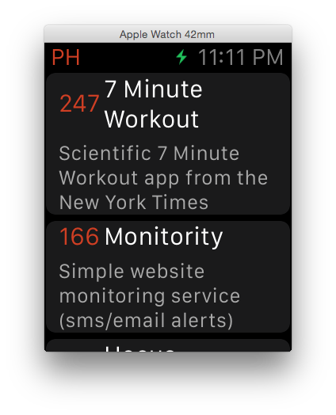

AppleWatchProductHunt
=====================

## Features
- An Apple watchapp written in Swift that displays the top posts from Product Hunt.
- Demonstrates how to use <a href="https://github.com/Alamofire/Alamofire" target="_blank">Alamofire</a> to make network requests.
- Demonstrates how to use the <a href="https://api.producthunt.com/v1/docs" target="_blank">Product Hunt API</a> to request the top posts of the day.

Pull requests are more than welcome :)

## Usage
For security reasons, I removed my API Key and API Secret tokens so if you want to run the app, you first need to create your tokens. Don't worry, it's as easy as described here:

1) Go to the <a href="https://www.producthunt.com/v1/oauth/applications" target="_blank">Product Hunt API Dashboard</a> and create a new application.

2) Give it a name and a redirect URL and press "Create Application". 

3) You should now have your API Key and API Secret ready to be copy and pasted into the project. Go in the 'InterfaceController.swift' class and add your keys.

## Requirements
- Xcode 6.2 beta 3

## Creator
- <a href="http://www.patrickbalestra.com">Patrick Balestra</a>, <a href="http://www.twitter.com/BalestraPatrick">@BalestraPatrick</a>
